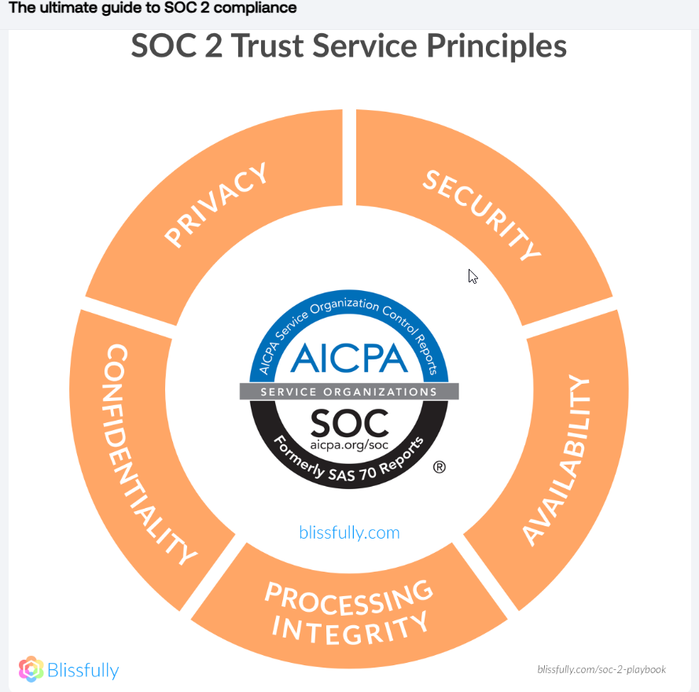

Rodolfo Gonzalez            01-07-2024
# Reading Notes

## Strategic Policy Development

### Discussion Points

1. **How would you convince your future company to pursue SOC2 compliance?**
   - Emphasize **Data Security**: Ensures the security and privacy of the company's data.
   - **Market Advantage**: Having SOC2 compliance gives a competitive edge.
   - **Regulatory Compliance**: Helps in meeting certain regulatory requirements.
   - **Risk Mitigation**: Aids in identifying and mitigating operational and security risks.
   - **Customer Trust**: Demonstrates a commitment to data security, enhancing customer trust and loyalty.

2. **What are the five SOC2 Trust Principles?**
   - **Security**: Protection against unauthorized access.
   - **Availability**: System is operational and usable as committed.
   - **Processing Integrity**: System processing is complete, accurate, and authorized.
   - **Confidentiality**: Information designated as confidential is protected.
   - **Privacy**: Personal information is handled in accordance with the privacy notice.

3. **How would you explain the three levels of the SOC2 pyramid in an analogy your friends or former colleagues would understand?**
   - Consider the SOC2 pyramid as a building:
     - **Base Level (Security)**: The foundation, ensuring safety from unauthorized access.
     - **Middle Level (Availability, Processing Integrity, Confidentiality)**: The main structure, ensuring functionality, stability, and restricted access to certain areas.
     - **Top Level (Privacy)**: The roof, protecting personal information.

## Additional Materials

### Videos

- [Security Audits - CompTIA Security+ SY0-401: 2.3](https://www.youtube.com/watch?v=FrzpyLZYKxo)

## References:

- [Vendr - SOC 2 Compliance Guide](https://www.vendr.com/blog/soc-2-compliance-guide)
- [AICPA - SOC 2](https://www.aicpa.org/interestareas/frc/assuranceadvisoryservices/soc2.html)
- [TechTarget - What is SOC 2](https://searchsecurity.techtarget.com/definition/Service-Organization-Control-2-SOC-2)
